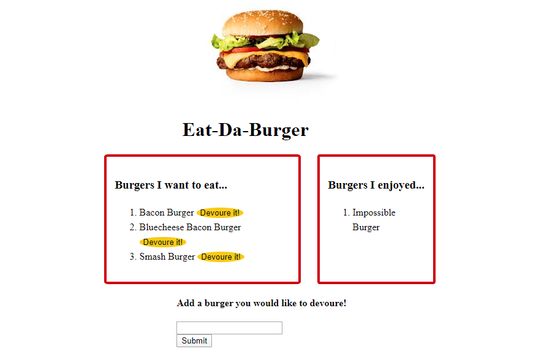

# Burger

## General Info

Full stack application that allows a user to add burgers they would like enjoy to a list of burgers. Then the user can "devour" them by hitting the devour button! 



You can start devouring burgers [here!](https://boiling-brook-12337.herokuapp.com/)

Or simply clone this repo to your local machine.

Install dependencies
```node.js
npm install
```

Run the application
```node.js
node server.js
```

## Technologies Used
* HTM/CSS
* JavaScript
* NodeJS
* Express
* Express-Handlebars
* MySQL

## Dependencies
* Express 4.17.1
* Express-handlebars 3.1.0
* mysql 2.18.1

 ## What I learned 

This application used a homemade ORM to manage the MySQL queries. Which made queries so much more efficient. It was great to use handlebars to generate the html dynamically. It was just fun to be able to use all of the pieces we have learned along the way to put them all together.  
